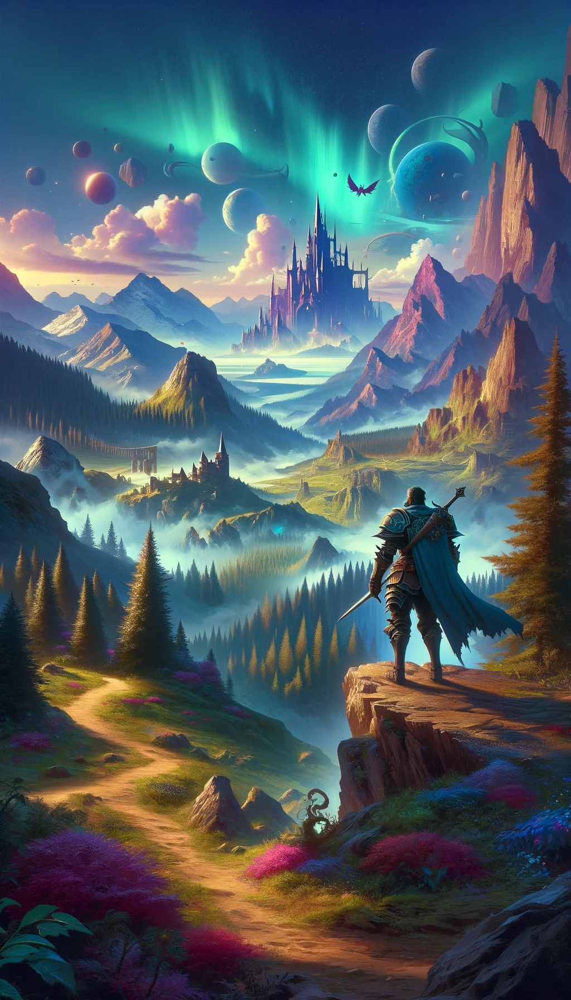
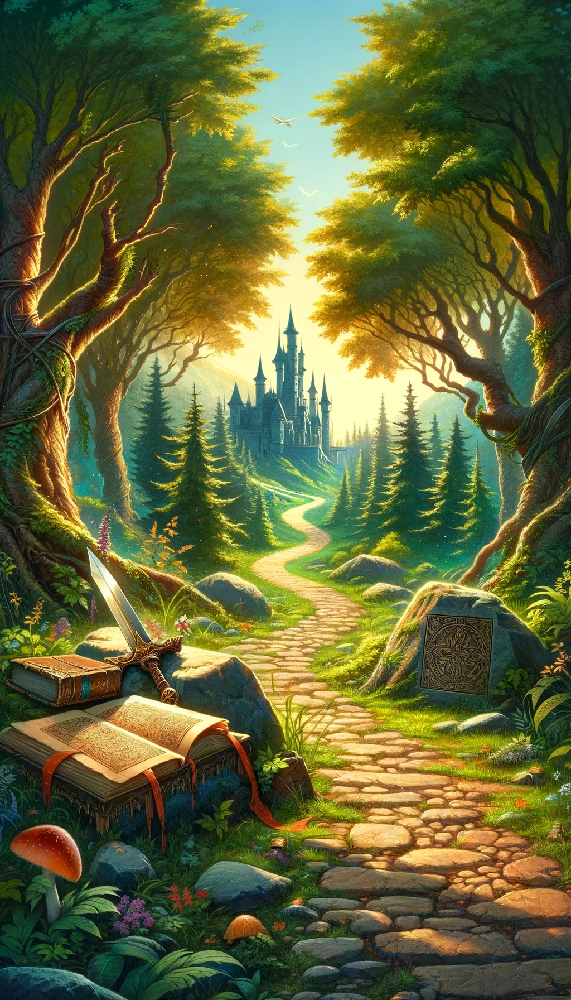
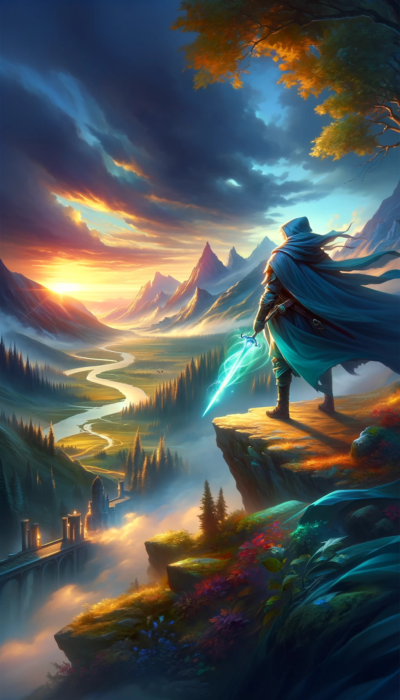

# Welcome to TaleForge, the Text Adventure Logic Engine to forge your own adventure with! 

Welcome enthusiasts of text adventures, role-playing games and programming! Our mission is simple yet ambitious: Empower storytellers to design immersive text adventures without a single line of code by bringing their dreams to life. 

## Vision

### A platform for text adventures and role playing

I dream of TaleForge to become a gateway to limitless adventures, where users can create, share and enjoy text based graphics adventures:

- **No-Code Adventure Design:** Create detailed, engaging text adventures without having to program.
- **Online Access:** Everything is online, accessible through a browser, making it easy to start anywhere, anytime.
- **Multiplayer Adventures:** Embark on quests with friends or design multiplayer narratives.
- **Visual Complements:** Enhance your stories with graphics, adding depth to your text adventures.
- **Community Sharing:** Release your creations to the community, inspiring and being inspired by fellow adventurers.
- **Future Expansion:** Role-playing features and more on the horizon, expanding what's possible in text adventures.

As a pet project born out of passion, TaleForge is also my journey into learning Rust and ReactJS, connecting with like-minded enthusiasts, and exploring modern software architecture and AI tools in game development.

### A learning resource for a Rust Web Application in hexagonal architecture

- **Experimenting with Rust:** I want to extend my currently limited experience with Rust.
- **Asses Rusts Capability for Webservices:** I would like to find out, wether this interesting option with its impressive performance is actually production ready.
- **Setup a hexagonal template:** I would like to take a Rust template of the project structure away that has proven valuable in Java.
- **Learn with AI:** I intend to use ChatGPT as my tutor doing this.

### Project is supposed to serve as a template for further AI projects

- **Template for generative AI:** I am investigating an efficient way to produce software in the age of AI. This project could serve as a template to communicate a desired way of structuring a project to a large language model.
- **Extend AI toolset:** Developing this I can extend the tools I use when colaborating with AI.

## The Road Ahead

Our journey begins with establishing a dynamic world where adventurers can freely explore. The roadmap includes:

1. **World Navigation:** Setting up an application that allows to navigate through an adventure world - for the moment without much interaction. This will be our MVP (Minimum Viable Product) to build upon. 
2. **Operational Infrastructure:** After developing the MVP on the application side, we need to reach a similar point for operation and deployment as a robust foundation for our future Journey.
3. **Single Player Adventures:** Crafting immersive experiences for individual explorers.
4. **Continuous Feature Expansion:** Adding new features, including multiplayer options and game designing tools.
5. **Community and Social Features:** Integrating social media features for sharing and collaboration.

## Get Involved

TaleForge is not just my journey; it's ours. Whether you're a seasoned Rust developer, a game design aficionado, or simply curious about text adventures, your contribution can help shape the future of TaleForge. Here's how you can get involved:

- **Contribute:** From code contributions to narrative designs, all forms of contributions are welcome.
- **Feedback:** Share your thoughts, ideas, and suggestions to make TaleForge even better.
- **Connect:** Join our community of Rust developers and adventure game enthusiasts.

## Technologies

- **Rust:** Rust will serve as the backend technology. Its high efficiency and small resource footprint will make hosting possible even for a hobby project.
- **ReactJS:** As a frontend technology I plan on using ReactJS. 
- **DDD & Hexagonal Architecture:** Employing modern architectural principles for scalable, maintainable code.
- **AI in Coding:** Experimenting with AI as a tool to enhance coding efficiency and creativity.

## Let's Forge Tales Together

Embark on this journey with us. Together, we can build a world of adventures, stories, and connections. Whether you're here to create, play, or contribute, you're a vital part of TaleForge.

**[Contribute to TaleForge](#)** | **[Join Our Community](#)** | **[Follow Our Progress](#)**
