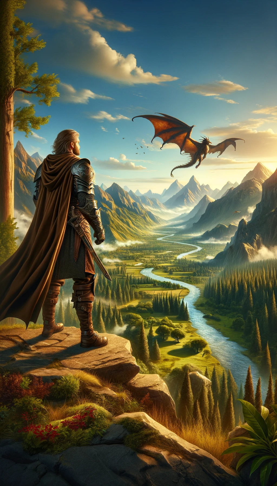

# TaleForge: Text Adventure Logic Engine

Welcome to **TaleForge**, a creative oasis for enthusiasts of text adventures and role-playing games. Our mission is simple yet ambitious: to empower you to design immersive text adventures without a single line of code. Whether you're a storyteller, a dreamer, or a game designer, TaleForge offers the tools to bring your narratives to life.

## Vision

TaleForge is more than just a platform; it's a gateway to limitless adventures. Here's what makes TaleForge unique:

- **No-Code Adventure Design:** Create detailed, engaging text adventures with ease.
- **Online Access:** Everything is online, accessible through a browser, making it easy to start anywhere, anytime.
- **Multiplayer Adventures:** Embark on quests with friends or design multiplayer narratives.
- **Visual Complements:** Enhance your stories with graphics, adding depth to your text adventures.
- **Community Sharing:** Release your creations to the community, inspiring and being inspired by fellow adventurers.
- **Future Expansion:** Role-playing features and more on the horizon, expanding what's possible in text adventures.

As a pet project born out of passion, TaleForge is my journey into learning Rust, connecting with like-minded enthusiasts, and exploring modern software architecture and AI tools in game development.

## The Road Ahead

Our journey begins with establishing a dynamic world where adventurers can freely explore. The roadmap includes:

1. **World Navigation:** Setting up the infrastructure to navigate through an adventure world.
2. **Operational Infrastructure:** Developing a robust foundation for operation and deployment.
3. **Single Player Adventures:** Crafting immersive experiences for individual explorers.
4. **Continuous Feature Expansion:** Adding new features, including multiplayer options and game designing tools.
5. **Community and Social Features:** Integrating social media features for sharing and collaboration.

## Get Involved

TaleForge is not just my journey; it's ours. Whether you're a seasoned Rust developer, a game design aficionado, or simply curious about text adventures, your contribution can help shape the future of TaleForge. Here's how you can get involved:

- **Contribute:** From code contributions to narrative designs, all forms of contributions are welcome.
- **Feedback:** Share your thoughts, ideas, and suggestions to make TaleForge even better.
- **Connect:** Join our community of Rust developers and adventure game enthusiasts.

## Technologies

- **Rust:** Learning and implementing Rust for robust, efficient game logic.
- **DDD & Hexagonal Architecture:** Employing modern architectural principles for scalable, maintainable code.
- **AI in Coding:** Experimenting with AI as a tool to enhance coding efficiency and creativity.

## Let's Forge Tales Together

Embark on this journey with us. Together, we can build a world of adventures, stories, and connections. Whether you're here to create, play, or contribute, you're a vital part of TaleForge.

**[Contribute to TaleForge](#)** | **[Join Our Community](#)** | **[Follow Our Progress](#)**
